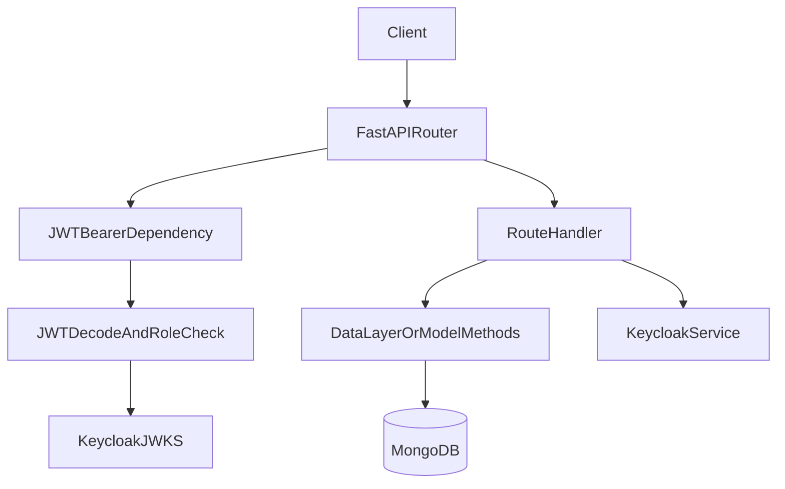

# Chapters Portfolio Backend Architecture

## Service Overview

This service is a FastAPI API backend for portfolio projects and project feedback with Keycloak-integrated JWT auth. It is organized as a layered application with route modules, auth guards, data-access helpers, document models, and schema contracts.

## High-Level Components

- `app.py`: application composition root (FastAPI init, CORS middleware, startup/shutdown hooks, router registration).
- `core/config.py`: environment-backed settings loaded with `pydantic-settings`.
- `core/database.py`: Motor client creation and Beanie initialization.
- `routes/`: HTTP endpoint handlers (`admin`, `user`, `project`, `utils`).
- `auth/`: auth dependency and JWT decode/JWKS lookup logic.
- `database/`: project and feedback persistence helpers.
- `models/`: Beanie `Document` models (`Project`, `Feedback`).
- `schemas/`: request/response DTOs.
- `services/`: Keycloak admin API and utility service wrappers.

## Request Flow

## Runtime Lifecycle

- On startup, `init_db()` initializes Beanie with `Feedback` and `Project` models.
- On shutdown, `close_db_connection()` closes the shared Motor client.
- CORS origins are loaded from `BACKEND_CORS_ORIGINS`.

## API Mounts

- `/admin` -> `routes/admin.py`
- `/user` -> `routes/user.py`
- `/projects` -> `routes/project.py`
- `/utils` -> `routes/utils.py`

## Auth Model

- `JWTBearer` enforces bearer token presence and decodes JWT payloads.
- Role checks are route-local via `allowed_roles`.
- If `DISABLE_AUTH=true`, auth is bypassed with a mock payload (intended only for local/test scenarios).

## Data Access Pattern

- Primary document persistence is through Beanie.
- Route handlers use a mix of:
  - database helper functions (`database/project.py`)
  - direct document usage (`Project.get`, `Feedback.find`)
- Public project reads enforce visibility constraints.

## External Dependencies

- MongoDB for persistence.
- Keycloak for:
  - JWT verification key discovery (`/protocol/openid-connect/certs`)
  - admin API user fetches (`/admin/realms/{realm}/users`)

## Coupling Hotspots and Risks

- Authorization intent drift exists in some routes where comments and `allowed_roles` differ.
- Async routes invoke sync HTTP operations in auth/service flows, which can affect throughput under load.
- Search endpoint uses regex queries from user input, requiring query-hardening controls.
- Several list/read queries are unbounded and should be documented as scale risks.
